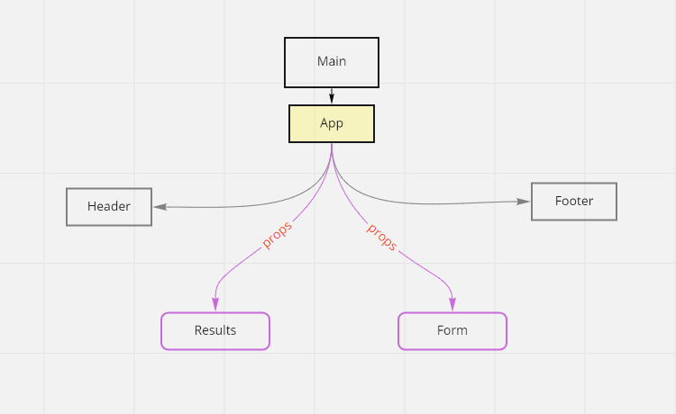

# RESTy

_Auther: Abeer Rafati_

**This app to explain how to convert class react component to function react component**

[sandbox deployment](https://codesandbox.io/s/cold-moon-0mzqm)

_To use this app:_

- clone this repo
- > `cd RESTy`
- to download all dependencies used in this app, use in terminal
  > `npm i`
- run react app, use in termintl
  > `npm start`

